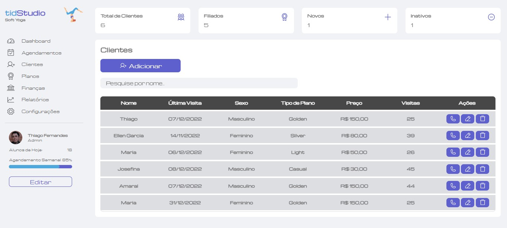
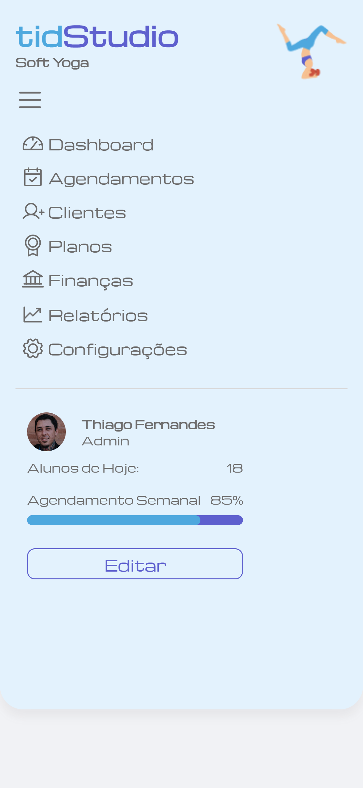
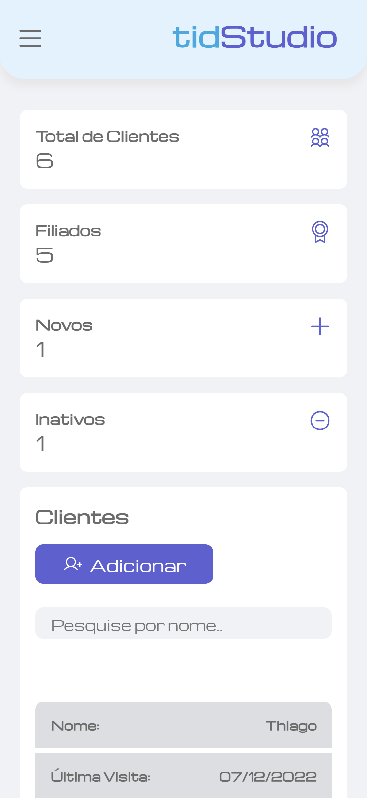
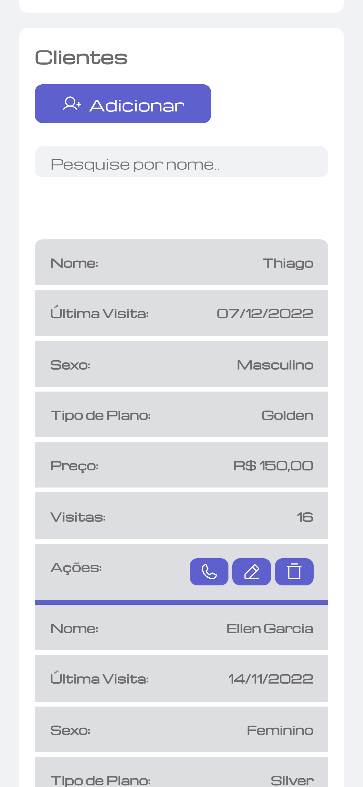
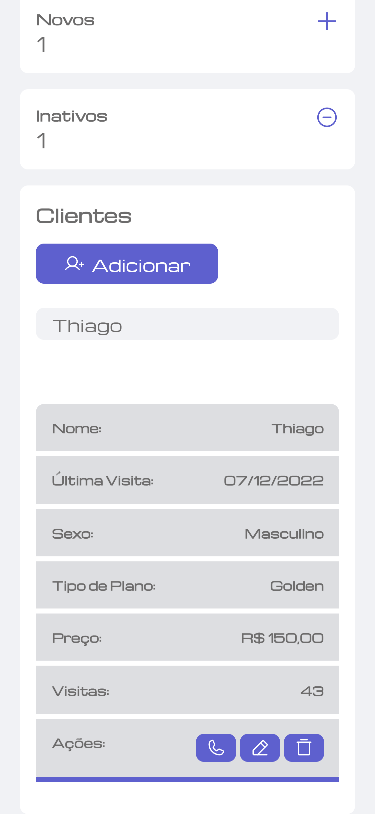
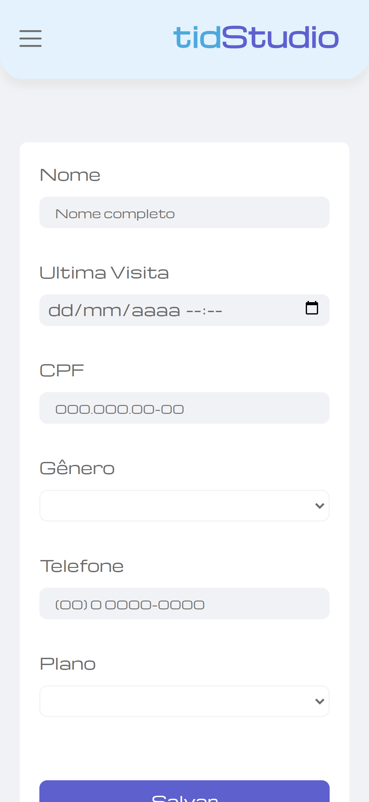
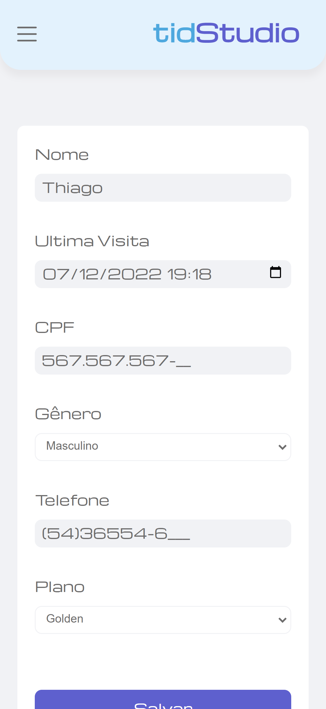
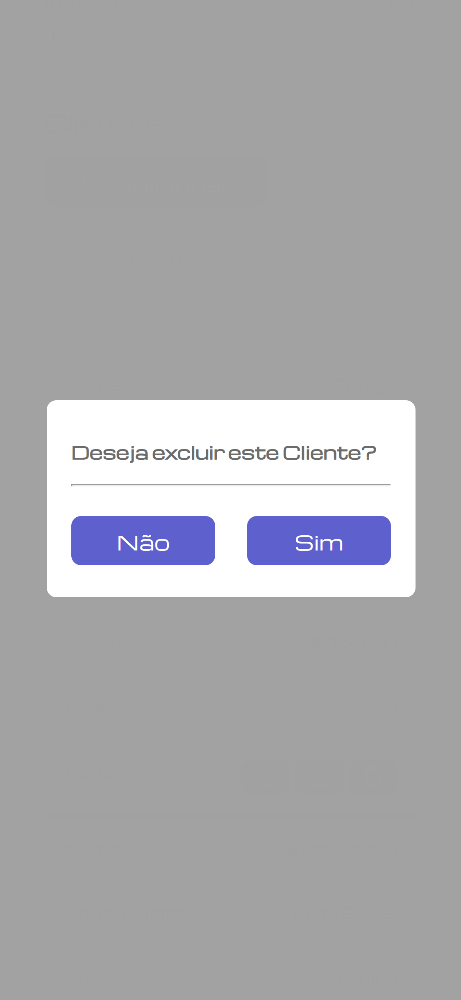
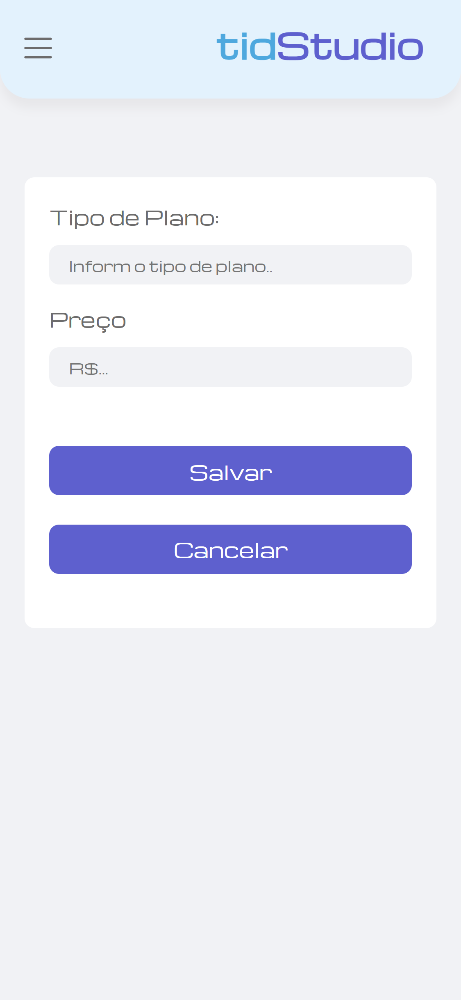

<h1 align="center">

  

</h1>

<h1>Teste prático realizado para vaga de desenvolvedor Fullstack na Tid Software</h1>


## Índice
<br />

- <a href="#-sobre-o-teste">Sobre</a>
- <a href="#-especificacoes">Especificações</a> 
- <a href="#-layout">Layout</a>
- <a href="#-como-executar-o-projeto">Como executar o projeto localmente</a>
- <a href="#-tecnologias">Tecnologias</a> 
- <a href="#-autor">Autor</a>
---

## 💻 Sobre o teste

📍 Foi realizada entrevista pessoal com o coordenador da área, onde ficou combinado de construir uma aplicação completa (Frontend em ReactJs e Backend em C#) com prazo de 15 dias de desenvolvimento.

---

## ⚙ Especificações

📍 Desenvolver um CRUD com as seguintes características: 

🔎 Cadastro de dois tipos de entidades relacionadas, ficando a minha escolha quais seriam;<br/>

🤖 Tecnologias: HTML/CSS, ReactJS, C#<br/>

---

🚨🚨🚨 Ficou quase tudo ao meu critério escolher referente a interfaces e banco de dados. Fiz as seguintes escolhas:

- [x] 👉 Optei por persistir os dados em SQL Server ;

- [x] 👉 Escolhi desenvolver um Cadastro de Clientes e Planos(entidades relacionadas) para um "Studio de Yoga";

- [x] 👉 Optei por apresentar de forma responsiva;

- [x] 👉 É possível listar todos os usuários e planos, adicionar, editar e excluir;

- [x] 👉 É possível pesquisar por nome;

- [x] 👉 O painel administrativo possui 4 indicadores de desempenho de clientes e mais 4 diferentes para planos;


--- 

<h1 align="center">
  🏆Conclusão🏆  
</h1>

- [x] O projeto FOI ENTREGUE no prazo combinado.

- [x] TODAS as características foram implementadas: 


---

## 🎨 Layout 

Um layout foi desenvolvido por mim no figma como parâmetro para o desenvolvimento das interfaces e esta disponível abaixo:

<a href="https://www.figma.com/file/NEGl4syw4dFihihjOVhP1g/Untitled?node-id=0-1&t=ARYb8ce45GiV4JXc-0">
  
</a>

---

## 📱 Mobile

<p align="center">

  
  
  
  
  
  
  
  
   
</p>


### 💻 Web

<p align="center">

  
  
  
  
  
  
  
    
  

</p>

---

## 🚀 Como executar o projeto

Este projeto possui um Frontend e um Backend separados, além de um banco de Dados local:

Antes de começar, você vai precisar ter instalado em sua máquina as seguintes ferramentas:

- [Git](https://git-scm.com)<br />
- [Node.js](https://nodejs.org/en/)

Além disto, é bom ter um editor de código para trabalhar com o código como o [VSCode](https://code.visualstudio.com/) .

Você tambem vai precisar do [Visual Studio 2022](https://visualstudio.microsoft.com/pt-br/vs/) para acessar e rodar os serviços da API.

#### 🎲 Rodando o Backend 

```bash

#Clone o repositório: 
$ git clone git@github.com:thiago-mfernandes/Teste-Tid-Software-ReactJs-CSharp.git

#Acesse a pasta do projeto pelo terminal/cmd
$ cd Teste-Pratico-Intesis

#Acesse a subpasta
$ cd api

#Acesse a subpasta
$ cd API-Tid

#Tendo instalado o Visual Studio 2022
**Clique 2x no ícone: API-Tid.sln**

#Com o Visual Studio aberto
**Clique na aba Depurar(Debug) / Iniciar Depuração(Start Debugging)

# O servidor inciará automaticamente e uma aba no chrome será aberta na porta:7147 - 

# acesse https://localhost:7147/swagger/index.html

```

#### 🎲 Rodando o Frontend 

```bash

#Como o repositório ja foi clonado, retorne a pasta raiz: Teste-Tid-Software-ReactJs-CSharp


#Acesse a pasta do projeto pelo terminal/cmd
$ cd Tid_Front


#Instale as dependências do projeto
$ npm install


#Execute a aplicação em modo de desenvolvimento
$ npm run dev


# O servidor inciará na porta:3000 - acesse http://localhost:3000

```
---

## 🛠 Tecnologias

As seguintes ferramentas foram usadas na construção do projeto:

#### **Frontend**  

- **[ReactJs](https://pt-br.reactjs.org/)**

- **[Typescript](https://www.typescriptlang.org/)**

- **[React Router](https://reactrouter.com/en/main)**

- **[Axios](https://axios-http.com/ptbr/docs/intro)**

- **[Styled-Components](https://styled-components.com/)**

- **[React Hook Form](https://react-hook-form.com/)**

- **[JSON Server](https://github.com/typicode/json-server)**

- **[Axios](https://axios-http.com/ptbr/docs/intro)**

- **[Vite](https://vitejs.dev/)**


#### **Utilitários**

- **[Phosphor Icons](https://phosphoricons.com/)**

- **[React Modal](https://reactcommunity.org/react-modal/)**

- **[React Input Mask](https://github.com/sanniassin/react-input-mask)**

- **[React Toastify](https://fkhadra.github.io/react-toastify/introduction)**

- **[Framer Motion](https://fkhadra.github.io/react-toastify/introduction)**

- **[Date FNS](https://date-fns.org/)**


> Veja o arquivo [package.json](https://github.com/thiago-mfernandes/Teste-Pratico-Intesis/blob/main/intesis/package.json)

#### **Backend**

- **[.NET Framework](https://dotnet.microsoft.com/pt-br/download/dotnet-framework)**


- **[Entity Framework](https://dotnet.microsoft.com/pt-br/download/dotnet-framework)**

#### **Banco de Dados**

- **[SQL Server](https://www.microsoft.com/pt-br/sql-server/sql-server-downloads)**

---

## 🦸 Autor


 
 <br />
 <sub>
  <b>Thiago Fernandes 🚀</b>
 </sub>
 

 
[](https://www.linkedin.com/in/thiago-mello-fernandes-frontend-react-js-javascript/)
---

## 📝 Licença

Feito com ❤️ por Thiago Fernandes 👋🏽 [Entre em contato!](https://whatsa.me/5519984009105)

---
